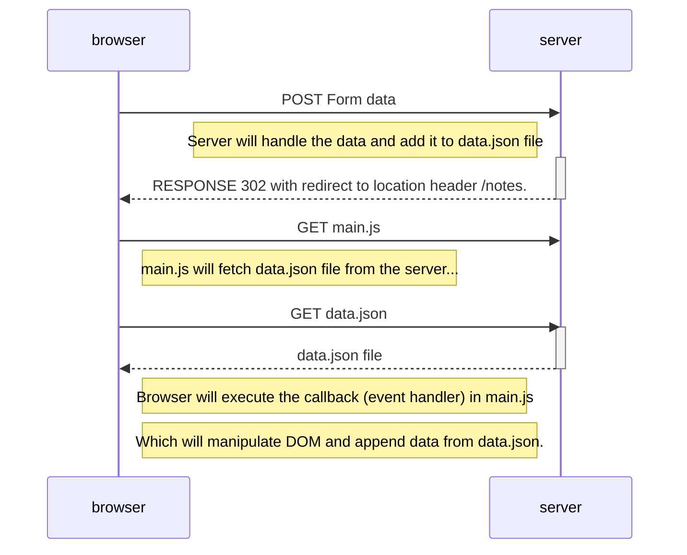

```mermaid
sequenceDiagram;
  participant browser
  participant server
  browser->>server: POST Form data
  Note left of server: Server will handle the data and add it to data.json file
  activate server
  server-->>browser: RESPONSE 302 with redirect to location header /notes.
  deactivate server
  browser->>server: GET main.js
  Note right of browser: main.js will fetch data.json file from the server...
  browser->>server: GET data.json
  activate server
  server-->>browser: data.json file
  deactivate server
  Note right of browser: Browser will execute the callback (event handler) in main.js
  Note right of browser: Which will manipulate DOM and append data from data.json.
```
