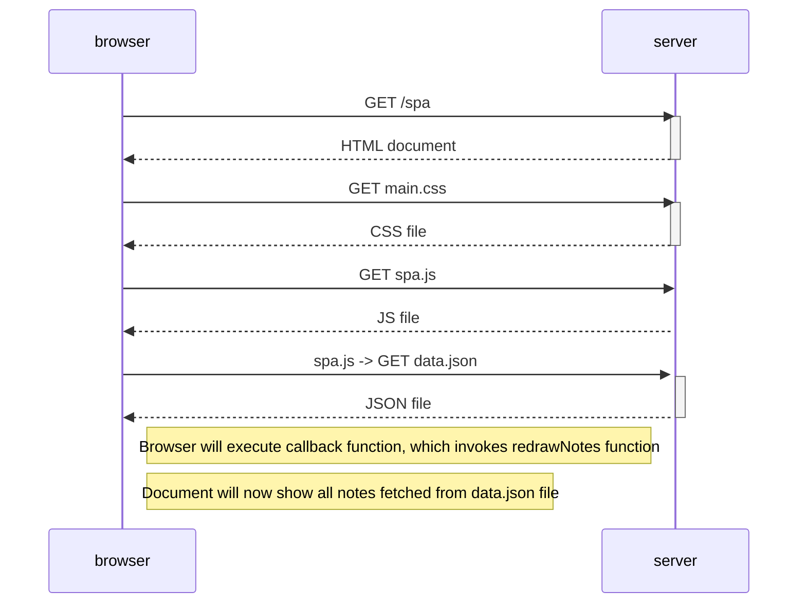

```mermaid
sequenceDiagram
  participant browser
  participant server
  browser->>server: GET /spa
  activate server
  server-->>browser: HTML document
  deactivate server
  browser->>server: GET main.css
  activate server
  server-->>browser: CSS file
  deactivate server
  browser->>server: GET spa.js
  activate server
  server-->>browser: JS file
  browser->>server: spa.js -> GET data.json
  activate server
  server-->>browser: JSON file
  deactivate server
  Note right of browser: Browser will execute callback function, which invokes redrawNotes function
  Note right of browser: Document will now show all notes fetched from data.json file
```
