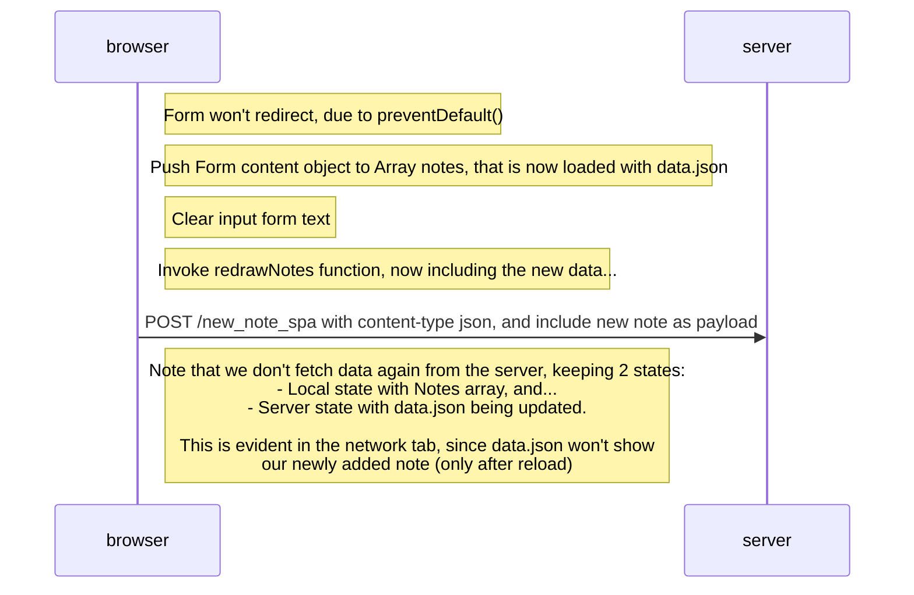

```mermaid
sequenceDiagram
  participant browser
  participant server

  Note right of browser: Form won't redirect, due to preventDefault()
  Note right of browser: Push Form content object to Array notes, that is now loaded with data.json
  Note right of browser: Clear input form text
  Note right of browser: Invoke redrawNotes function, now including the new data...

  browser->>server: POST /new_note_spa with content-type json, and include new note as payload

  Note right of browser: Note that we don't fetch data again from the server, keeping 2 states:<br/>- Local state with Notes array, and...<br/>- Server state with data.json being updated.<br/><br/>This is evident in the network tab, since data.json won't show<br/>our newly added note (only after reload)
```
